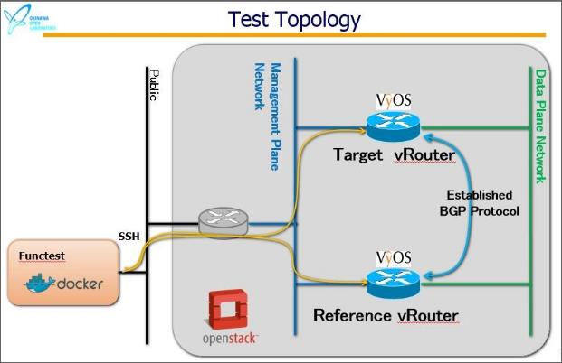
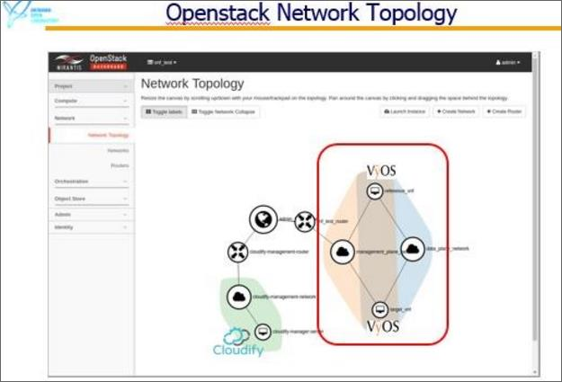
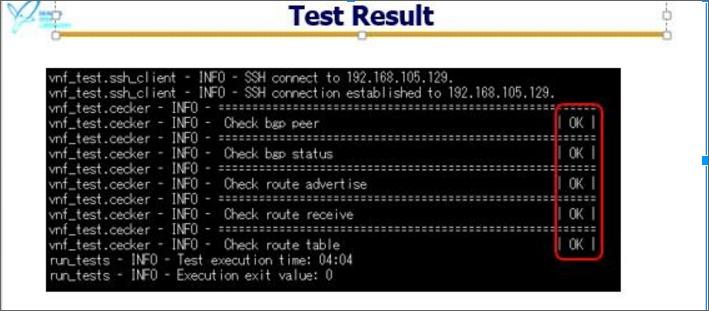

**Proposal of new VNF onboarding for Danube Functest**
------------------------------------------------------

** 1. Background**
Firstly, I explain the background of our Proposal. ETSI Proposed to NFV Architecture, And there are many open source VNF For example VyOS , OpenvSwitch , etc .And there are VNF Appliance from Existing vendor.For example ,VyOS and Vyatta Core Core from Brocade, CSR1000V from cisco and more. But, currently there is not any standardized platform for testing VNF Appliance auto matically.
 
There are problems of VNF testing. VNF Appliance is still developing, so there is no standard .Performance and stability is depend on flavors. Many test patterns are required in VNF testing more than hardware appliance. Because number of test pattern is depend on variation of resources, and variation of virtualization platform.
 
**2. How to test VNF**
 1. Test System is based on functest.
 2. VNF Testing topology was made by cloudify using blueprint.Target VNF and reference VNF are booted and Network are made.
 3. New Functest module for VNF test preset test configuration to Target VNF and reference  VNF using ssh
 4. New Functest module for VNF test run test and get result
 5. Final step is Reporting

**3.Concept**
Test scenarios was written yaml file.The test system use template file for VNF testing command. So when user want to add new test item, user don't have to edit source code.for example OSPF.In futuer, This test suiet  will be able to change  image-file(Otehr vRouter). So we can do do test of Interoperability for different vRouter.
 
**4.PoC**
Okinawa Open Labs makes Proof of Concept that two VyOS VMs are booted and do test of Interoperability of BGP Protocol

**Test item are as follows **
1. Confirmation of peer session of BGP between target vRoutvRouterere and reference vRouter.
2. Confirmation of status of BGP for target vRoutere.
3. Confirmation of advertised routes from target vRouter to reference vRouter.
4. Confirmation of received routes from reference vRouter to target vRouter
5. Confirmation of routing table of BGP for vRouter.

